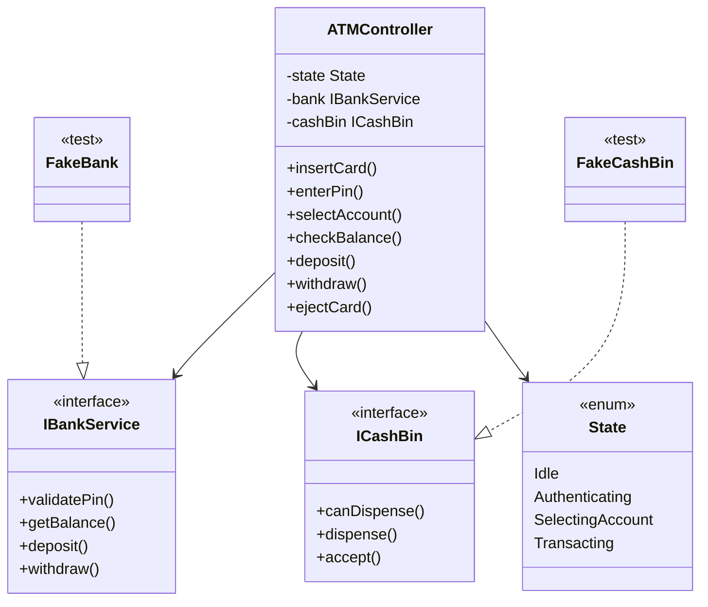
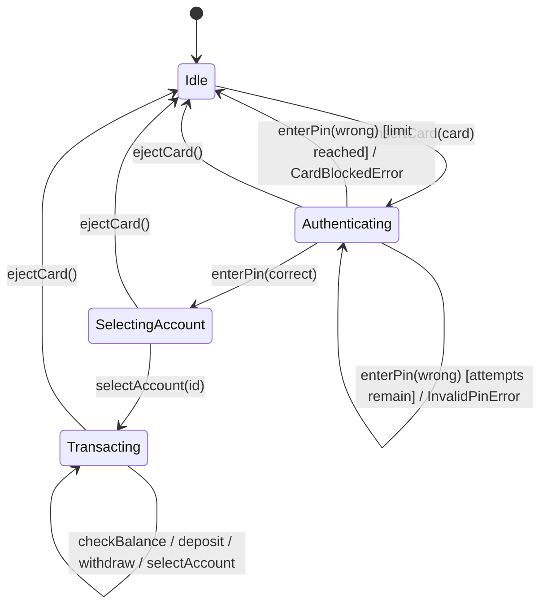
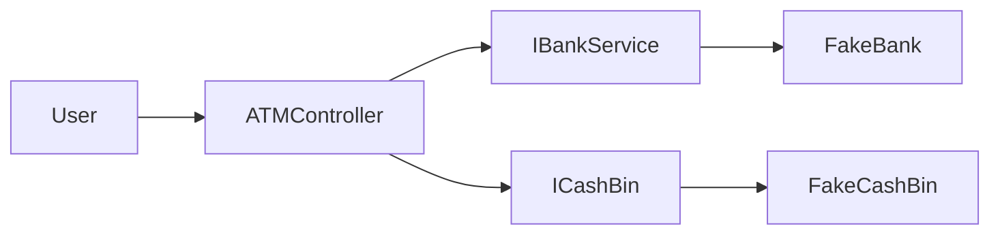

# simple-atm

A small, well-tested ATM **controller** modelled as a state machine. It owns the
session flow (insert card → enter PIN → select account → transact → eject) but
delegates all banking and cash-hardware behaviour to injected interfaces, so the
controller can be exercised in isolation against test doubles.

## Build & Test

The project uses CMake (C++17) with the single-header [doctest](https://github.com/doctest/doctest)
framework vendored under `third_party/`.

```bash
cmake -S . -B build -DCMAKE_BUILD_TYPE=Debug && cmake --build build
ctest --test-dir build --output-on-failure        # or: ./build/atm_tests
```

No CMake installed? The suite is header-light and compiles directly:

```bash
clang++ -std=c++17 -Wall -Wextra -Wpedantic \
    -Iinclude -Ithird_party -Itests \
    src/ATMController.cpp tests/test_controller.cpp -o atm_tests && ./atm_tests
```

Expected: `21 passed | 0 failed`.

## Design

The codebase is organised around **ports & adapters (dependency inversion)** so the
core logic is reusable and testable in isolation:

- **Ports** (`include/atm/Ports.h`) — `IBankService` and `ICashBin` are pure
  interfaces. `ATMController` depends only on these abstractions (injected by
  reference), never on a concrete bank or hardware. Swap in a real backend for
  production or a fake for tests without touching the controller.
- **Controller** (`include/atm/ATMController.h`, `src/ATMController.cpp`) — an
  explicit `State` machine (`Idle → Authenticating → SelectingAccount →
  Transacting`). Every operation is guarded by `requireState`, so out-of-order
  calls fail loudly with `InvalidStateError` instead of corrupting state.
- **Exceptions** (`include/atm/Exceptions.h`) — a typed hierarchy under `ATMError`,
  so callers and tests can distinguish failure modes (`InvalidPinError`,
  `CardBlockedError`, `AccountNotFoundError`, `InsufficientFundsError`,
  `InsufficientCashError`, `CashBinError`, …).
- **Security** — the PIN is never stored in the controller; it is forwarded
  straight to `IBankService::validatePin`.
- **Withdrawal integrity** — withdraw checks the bin can dispense, debits the bank,
  then dispenses cash. If the hardware faults mid-dispense, the bank debit is
  rolled back (refunded) and the original error propagates, so a customer is never
  charged for cash they did not receive.

The same ports power the tests: `tests/Fakes.h` provides in-memory `FakeBank` /
`FakeCashBin` doubles, and `tests/test_controller.cpp` is a 21-case doctest suite
that doubles as an executable specification (state guards, PIN-attempt limits,
deposit/withdraw, rollback, session reset).

## Architecture (UML)

### Class Diagram



### State diagram — session flow



### Design Idea


## Notes & Assumptions

- `Money` is `int` (whole dollars) — simple and sufficient for this exercise; a
  dedicated value type would be the production choice (see TODO).
- The controller models a **single in-progress session** at a time.
- The **bank is the source of truth** for PINs, account ownership and balances; the
  controller never caches balances.
- `FakeBank` / `FakeCashBin` are **test-only** doubles — no real adapter is shipped.

## TODO / Future Work

- [ ] Real `IBankService` adapter (database / HTTP) behind the existing port.
- [ ] Persistence for accounts and balances.
- [ ] Daily withdrawal limit and per-transaction caps.
- [ ] Replace `Money = int` with a `Money` value type (overflow-safe, currency-aware).
- [ ] Session timeout and concurrency handling.
